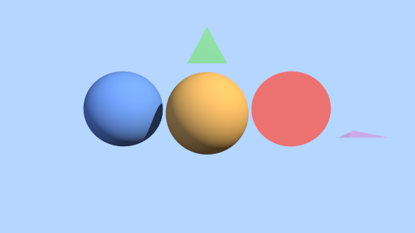

# elenaLF-SJU2
Elena Lehto FredenbrinkSystemutveckling Java - Uppgift 2

## Planering : Math ->Ray ->geometry intersections ->Scene ->Camera ->Materials + Lights ->Render ->Image ->Main
# Raytracer – Laboration 2

Det här projektet är en enkel raytracer skriven i Java. Syftet med laborationen är att träna objektorienterad programmering med bland annat arv, abstrakta klasser, interface, polymorfism, inkapsling och method overriding.

Programmet skickar ut strålar från en kamera in i en scen och kontrollerar om strålarna träffar olika objekt. Resultatet används sedan för att skapa en bild.

## Struktur

Projektet är uppdelat i olika delar:

```text
geometry
- Shape
- Sphere
- Triangle
- HitRecord

material
- Material
- SolidColor
- Lambertian

math
- Vector3D
- Ray
- Color

render
- Renderer
- Image

scene
- Scene
- Camera
- PointLight
```

`Main` används för att skapa scenen, lägga till objekt, ljus och kamera och sedan starta renderingen.

---

## Shape och polymorfism

Alla geometriska objekt ärver från den abstrakta klassen `Shape`.

Exempel på objekt som finns i projektet:

```text
Sphere
Triangle
```

Varje shape implementerar sin egen version av:

```java
hit(Ray ray, double tMin, double tMax)
```

Metoden kontrollerar om en ray träffar objektet.

Om ingen träff sker returneras:

```java
Optional.empty()
```

Om rayen träffar objektet returneras ett `HitRecord` med information om bland annat träffpunkten, normalen och materialet.

`Scene` sparar alla former i:

```java
List<Shape>
```

Det gör att scenen inte behöver veta om objektet till exempel är en `Sphere` eller `Triangle`. Java kör automatiskt rätt `hit()`-metod beroende på vilken typ av objekt det är.

Detta gör projektet lättare att bygga ut.

---

## Hur lägger man till en ny Shape?

För att lägga till en ny form skapar man en ny klass som ärver från `Shape`.

Exempel:

```java
public final class Box extends Shape {

    public Box(Material material) {
        super(material);
    }

    @Override
    public Optional<HitRecord> hit(
            Ray ray,
            double tMin,
            double tMax) {

        // Beräkna om rayen träffar boxen

        return Optional.empty();
    }
}
```

Den nya klassen behöver implementera sin egen beräkning i `hit()`.

När klassen är klar kan den läggas till direkt i scenen:

```java
scene.add(new Box(material));
```

Ingen ändring behövs i `Scene` eller `Renderer`.

Detta följer Open/Closed Principle eftersom nya former kan läggas till utan att ändra den befintliga renderingslogiken.

---

## Material

Projektet använder ett `Material` interface.

Det finns två implementationer:

```text
SolidColor
Lambertian
```

### SolidColor

`SolidColor` returnerar alltid samma färg och tar inte hänsyn till ljus eller skuggor.

Det gör att ett objekt kan se ganska platt ut.

### Lambertian

`Lambertian` används för diffus belysning.

Ljusstyrkan beror på vinkeln mellan objektets normal och riktningen mot ljuskällan.

I koden används bland annat:

```java
normal.dot(lightDir)
```

Om ytan är riktad mot ljuset blir den ljusare. Om den är riktad bort från ljuset får den inget direkt ljus.

---

## Ljuskällor och skuggor

Projektet använder `PointLight` som ljuskälla.

En `PointLight` har:

```text
position
color
intensity
```

För att beräkna skuggor skickas en extra ray från träffpunkten mot ljuset.

Om den rayen träffar ett annat objekt innan den når lampan betyder det att ljuset är blockerat och punkten ligger i skugga.

---

## Kamera

Projektet har en konfigurerbar `Camera`.

Kameran har bland annat:

```text
lookFrom
lookAt
up
field of view
aspect ratio
```

Kameran skapar rays genom bilden med metoden:

```java
getRay(s, t)
```

Renderer använder sedan dessa rays för att kontrollera vad som syns i varje pixel.

---

## Antialiasing

För att få mjukare kanter skickas flera rays genom varje pixel.

Raysens position varierar lite slumpmässigt inom pixeln och färgerna räknas sedan ihop till ett medelvärde.

I projektet används:

```java
SAMPLES_PER_PIXEL = 64
```

Fler samples ger mjukare kanter men gör också renderingen långsammare.

---

## Rendering

`Renderer` går igenom alla pixlar i bilden.

För varje pixel:

1. Kameran skapar en ray.
2. Scenen kontrollerar vilket objekt rayen träffar.
3. Närmaste träffen används.
4. Objektets material räknar ut färgen.
5. Färgen sparas i bilden.

Om rayen inte träffar något objekt används bakgrundsfärgen.

---

## Bildformat

Programmet sparar resultatet som:

```text
render.png
render.ppm
```

PNG skapas med Java JDK:s inbyggda `ImageIO`.

---

## OOP i projektet

Projektet använder flera objektorienterade principer:

| Princip               | Exempel                                                          |
| --------------------- |------------------------------------------------------------------|
| Arv                   | `Sphere`och `Triangle` ärver från `Shape`                        |
| Abstraktion           | `Shape` beskriver vad alla former måste kunna göra               |
| Interface             | `Material` används för olika typer av material                   |
| Polymorfism           | `Scene` arbetar med `Shape` istället för specifika former        |
| Method overriding     | Varje Shape har sin egen implementation av `hit()`               |
| Inkapsling            | Varje klass ansvarar för sin egen data och logik                 |
| Open/Closed Principle | Nya Shapes och Materials kan läggas till utan att ändra Renderer |

---

## Köra programmet

Kör `Main`.

Programmet renderar scenen och skapar:

```text
render.png
render.ppm
```

I terminalen skrivs även information ut om upplösning, antal samples och hur lång tid renderingen tog.

---

## Funktioner som är implementerade

Projektet innehåller bland annat:

```text
- Sphere
- Triangle
- Vector3D
- Ray
- Color
- Scene med List<Shape>
- SolidColor
- Lambertian
- PointLight
- Skuggor
- Konfigurerbar Camera
- Antialiasing
- PNG och PPM output
```

Projektet uppfyller grundkraven och innehåller även funktionalitet från VG-delen genom material, belysning, skuggor, kamera och antialiasing.

## Källor. fick mycket insperation av denna projekt
#### <https://github.com/scratchapixel/scratchapixel-code/tree/main>
#### <https://raytracing.github.io/books/RayTracingInOneWeekend.html>
#### <https://github.com/jianjianh1/raytracing-oneweekend>
#### <https://github.com/njeff/raytracer0/tree/master>
#### <https://www.youtube.com/watch?v=kHNewYRvgSk>
### <https://raytracing.github.io/>
### [Lembert's cosine law:  Surface law] <https://www.youtube.com/watch?v=0zmLe4SssJc>


